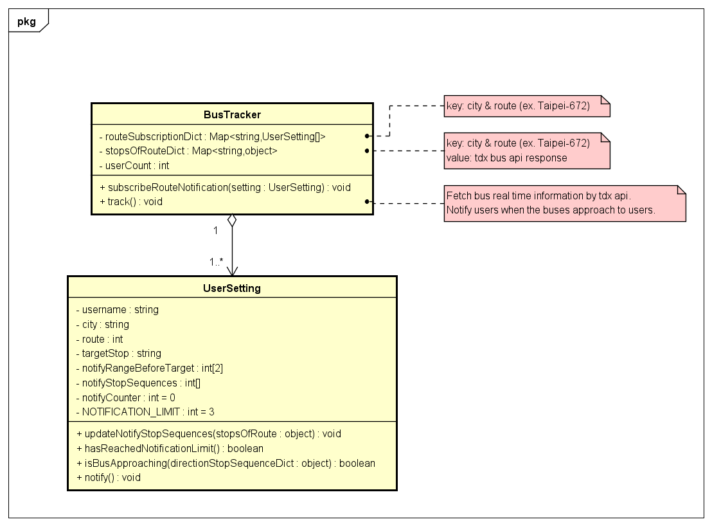

# Bus Tracker
Users can track the bus real time information and the system will automatically notify users when the bus approach to the stop.

## Environment

- python version: 3.7.7

## Setup

1. In Linux, change directory to the root of the project and run the belowing script.
    ```
    sh setup.sh
    ```

2. Register as a [tdx member](https://tdx.transportdata.tw/register) and login to get the **Client Id** and **Client Secret**.

3. Enter your **Client Id** and **Client Secret** in `.env` file.

4. Run `main.py`, then you can track the bus!

## OOA



## bus data source 

- TDX swagger api: https://tdx.transportdata.tw/api-service/swagger/basic/2998e851-81d0-40f5-b26d-77e2f5ac4118#/
- notes for the bus APIS: https://ptxmotc.gitbooks.io/ptx-api-documentation/content/api-zi-liao-shi-yong-zhu-yi-shi-xiang/buslive.html
- odata query documentation: https://ptxmotc.gitbooks.io/ptx-api-documentation/content/api-te-se/odata.html